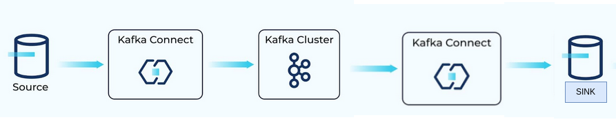

# Kafka Connect con PostgreSQL

Este proyecto configura un entorno de prueba para Kafka Connect con PostgreSQL, utilizando Docker Compose.



## Requisitos previos

- Docker y Docker Compose instalados en su sistema
- Acceso a internet para descargar las imágenes de Docker necesarias

## Configuración y ejecución

1. Clone este repositorio en su máquina local:
   ```
   git clone https://github.com/AZapata27/kafka-connect-demo.git
   cd kafka-connect-demo
   ```

2. Asegúrese de que el archivo `docker-compose.yml` esté presente en el directorio.

3. Cree un directorio `connectors` en el mismo nivel que su `docker-compose.yml`:
   ```
   mkdir connectors
   ```

4. Ejecute el script de inicialización para preparar el entorno:
   ```
   docker compose up -d
   ```

5. Espere a que todos los servicios estén en funcionamiento. Puede verificar el estado de los contenedores con:
   ```
   docker-compose ps
   ```

6. Cuando todos los servicios estén en estado "Up", ejecute el script para inicializar los conectores:
   ```
   ./init-connectors.bash
   ```

## Verificación

- Puede acceder a la consola de Redpanda en `http://localhost:8080` para verificar los tópicos de Kafka.
  
- Para verificar el estado de los conectores, use:
  ```
  curl http://localhost:8083/connectors
  curl http://localhost:8084/connectors
  ```

## Notas adicionales

- Asegúrese de que los puertos 5432, 9092, 8080, 8083 y 8084 estén disponibles en su sistema.
- Los datos de PostgreSQL se persistirán en un volumen Docker llamado `postgres_data`.
- Los archivos de configuración de los conectores se deben colocar en el directorio `./connectors`.

## Solución de problemas

- Si encuentra problemas con los permisos al ejecutar los scripts, asegúrese de que sean ejecutables:
  ```
  chmod +x init.bash init-connectors.bash
  ```
- Si los conectores no se inician correctamente, verifique los logs de los contenedores:
  ```
  docker-compose logs kafka-connect-source
  docker-compose logs kafka-connect-sink
  ```

## Limpieza al finalizar la practica

Para detener y eliminar todos los contenedores y volúmenes:
```
docker-compose down -v
```
